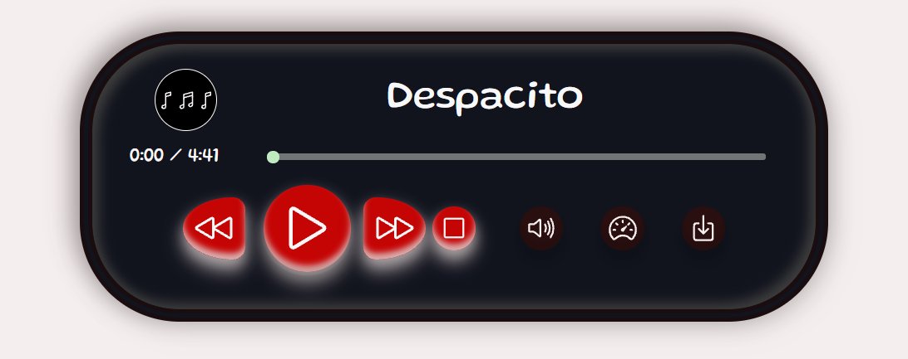
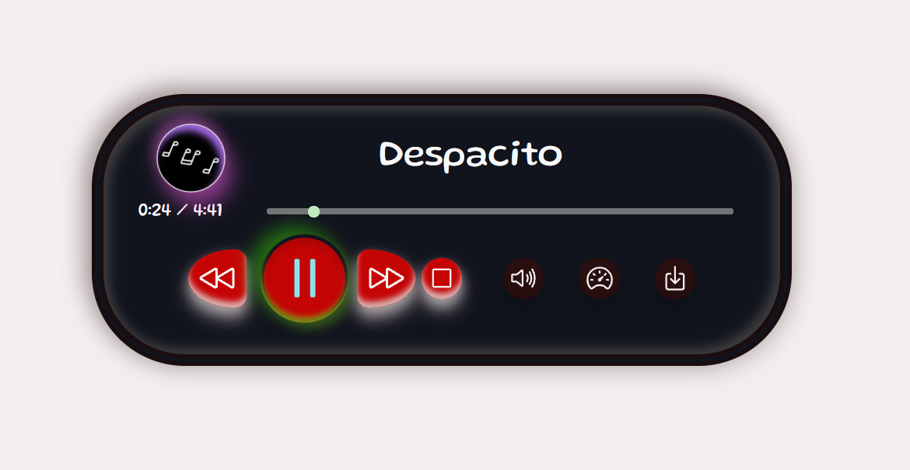
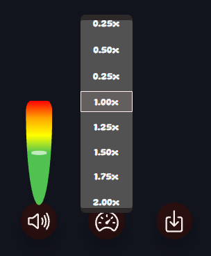

# Music-Player-Html-Css-Javacript
Music player using HTML , CSS and Javascript
### music player with buttons and seekbar
 play , pause , stop , volume mute/unmute , download song
 duration seekbar , volume adjust , playback speed adjust
 
 [See website demo](https://htmlpreview.github.io/?https://github.com/Rahman1712/Music-Player-Html-Css-Javacript/blob/main/index.html)
 
Music Player

Start Playing

Music adjust

